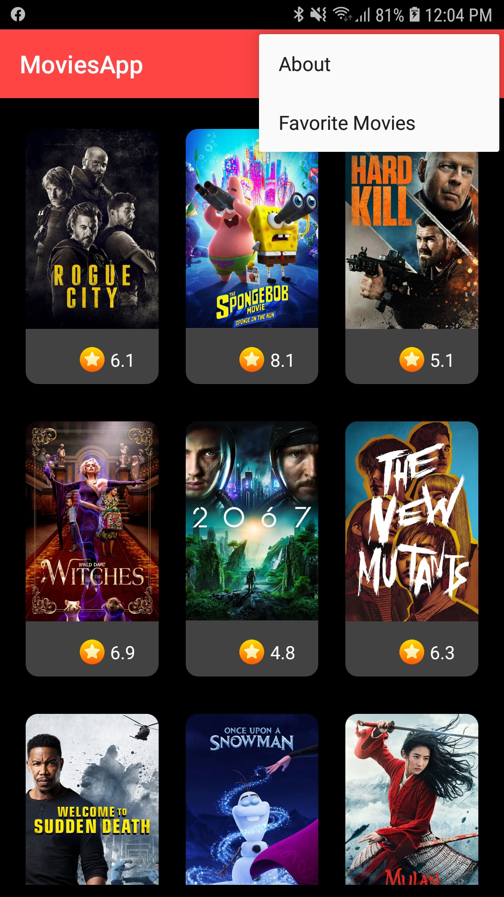
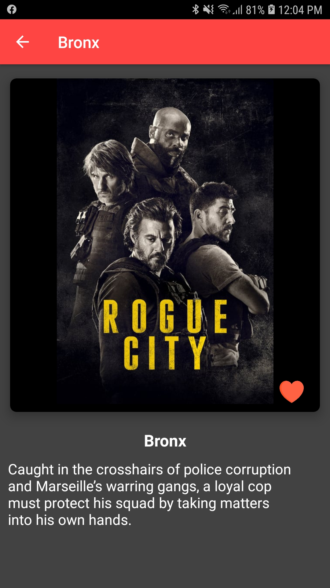
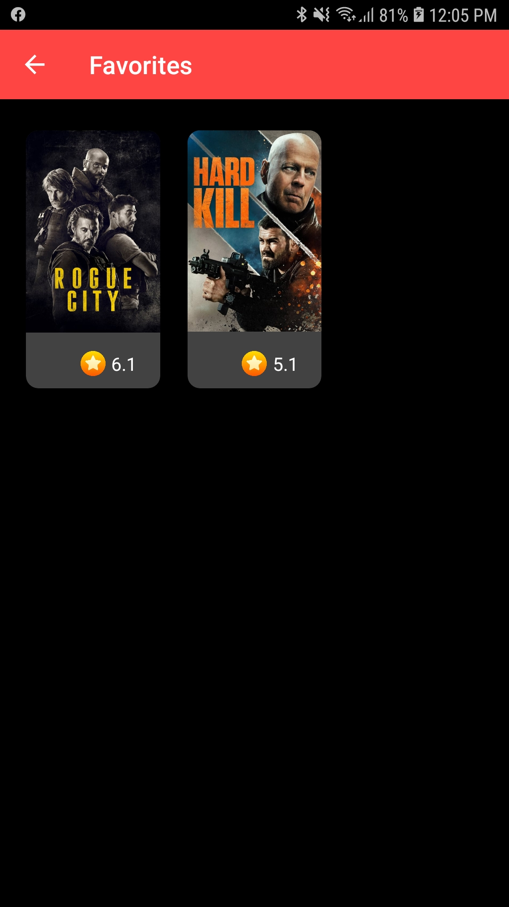
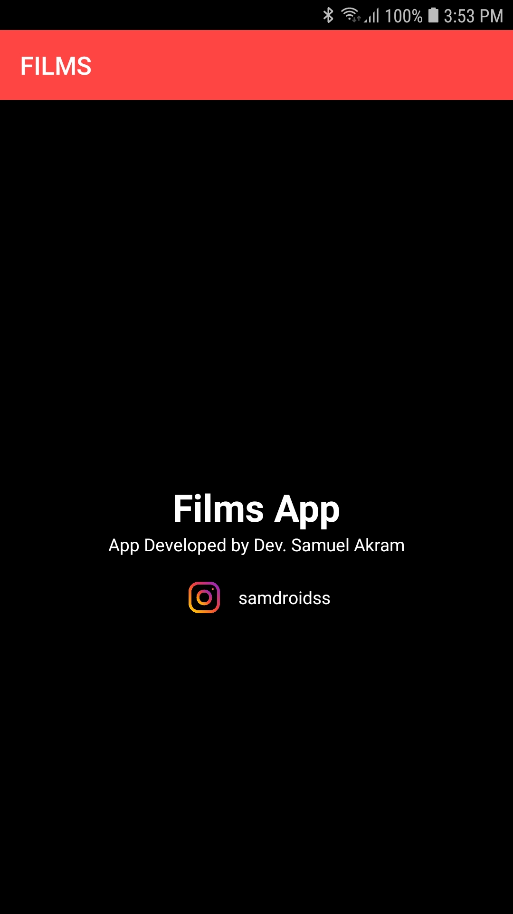

# MoviesApp
MoviesApp built with MVVM + Retrofit + Dagger2 + Offline Functinality

Get your API KEY FROM TMDB's website. 
This App includes:
* Dagger2
* Swipe Refresh
* Databinding
* RoomDatabase
* ViewModel
* Retrofit2
* CardView, RecyclerView
* Offline Functionality 

MainActivity

MovieActivity

FavoritesActivity

AboutActibity

